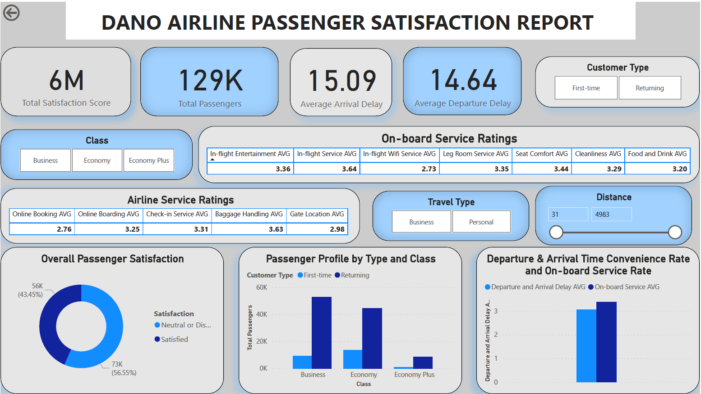

# Dano Airlines Report

## Introduction 
This is a power BI project on the analysis of **Dano Airline** passengers survey results. This dashboard helps the airline understand the satisfaction rate of their passengers, the problems with their services and what area they can improve on. 

## Problem Statement
- To recommend a data-driven strategy for increasing Dano Airlines’ satisfaction rate.

## Skills / Concepts Demonstrated 
The following Power BI features were used
- DAX
- Page navigation
- filters

The passengers were asked on how much arrival delay and departure delay time they experienced, if they were satisfied or neutral/dissatisfied generally and were asked to rate on a range of 1 to 5 based on the different points listed below,

- Baggage Handling
- Check-in Services
- Cleanliness
- Departure and Arrival Time Convenience
- Food and Drink
- Gate Location
- In-flight Entertainment
- In-flight Service
- In-flight wifi service
- Leg Room service
- On-board service
- Online boarding
- Online booking
- Seat comfort
  
## Analysis 

- There were a total of 129,000 customers that took this survey test.
- The number of neutral/dissatisfied passengers at 56.55% are more than that of the satisfies passengers which is at 43.45%
- The average arrival time and departure time is around 15 minutes.
- Most of the first-timers were neutral/dissatisfied. 
- The passengers in Business class were more satisfied compared to those in Economy and Economy Plus.
- Passengers who travelled shorter distances were less satisfied compared to those who travelled longer distance.
- On average, the In-flight service, Online booking was rated the lowest.

## Recommendation 
Since the number of neutral/dissatisfied passengers are more than that of the satisfied passengers, the airline must work on improving their services.
- The airline should extend better amenities and services to Economy and Economy Plus, they can optimize seat configurations to provide more comfortable seating in Economy and Economy Plus, they should maximize legroom to improve passenger comfort during the flight. They can introduce additional amenities in Economy Plus, such as complimentary snacks, pillows, and blankets.
- The airline should set realistic expectations regarding the level of amenities and services available on shorter flights and clearly communicate it to passengers. They can provide pre-packaged amenities for passengers on shorter flights, such as snack, water, or a small comfort kit and minimize delays in responding to passenger requests. They can train cabin crew to efficiently manage shorter flights, ensuring they can deliver a high level of service within the compressed timeframe and emphasizing the importance of positive interactions with passengers during the brief journey.
- The airline can ensure the online booking platform is fully optimized for mobile devices, allowing users to book flights conveniently from their smartphones or tablets. They can simplify the booking flow to minimize the number of steps required to complete a reservation, implement a progress indicator to inform users about the stages of the booking process and provide a clear and immediate booking confirmation with all relevant details.

## Conclusion 
The airline should establish a continuous feedback loop by encouraging passengers to provide insights on their experiences. They should transparently communicate the changes and improvements being made based on customer feedback thereby building trust.
